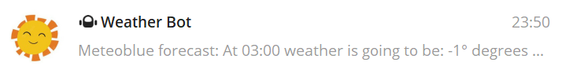
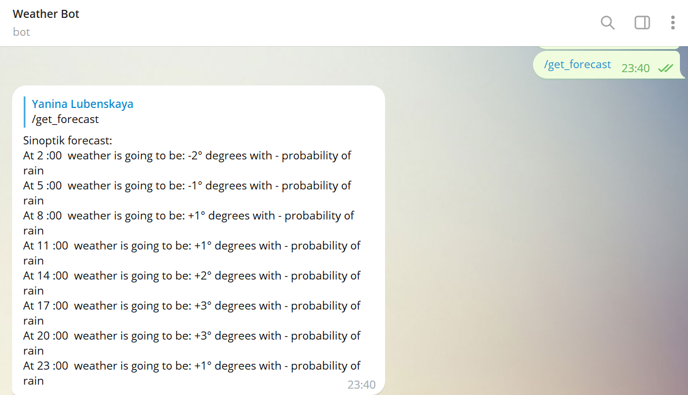
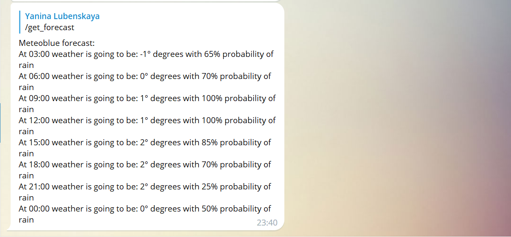

# Weather Bot

This bot scrapes info about the weather in Lviv on two different websites and sends it to a Telegram Bot.

It can send a message on demand of a user, or it can be scheduled as a task and run at specific intervals.

Make sure to include your bot token to the code to be able to use it.

Example screenshots:

